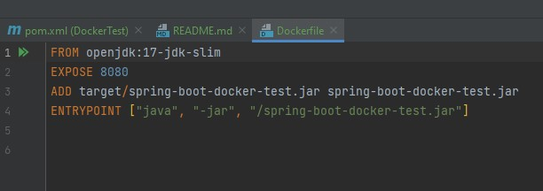
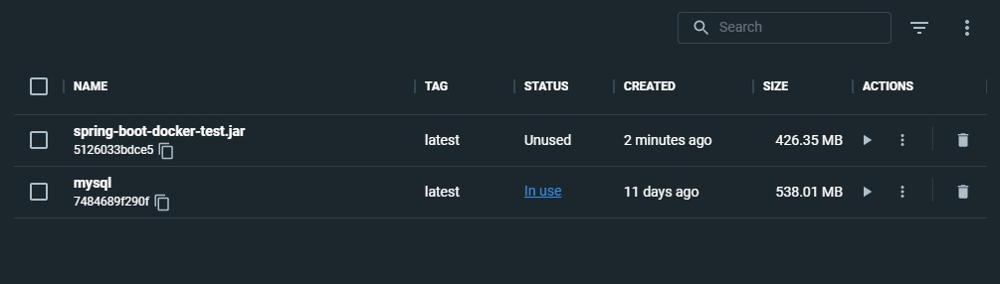

Trying docker containerizing.

First we need to create a .jar file which is an executable java file. We can create .jar file with command below. 

```
mvn clean package -Pnative
```

With this command we are creating native image but only spring 3.0 supports native image. So any spring version under 3.0 cannot take native image. 

After creating .jar file we are ready to create our Dockerfile.

In Dockerfile:



First line is for the java version.

Second line is for the port that docker image will run.

Third line is the path of the .jar file docker is going to run.

Fourth line is the commands to run jar file.

After creating Dockerfile we need to write some commands on terminal.

```
docker build -t spring-boot-docker-test.jar
```

After taking build of our Dockerfile our image should be created as spring-boot-docker-test.jar.


```
docker run -p 9090:8080 --name spring-boot-docker-test spring-boot-deneme.jar
```
With the code above we can run our docker image on localhost 9090 port.




As you can see our image is ready to run and use.